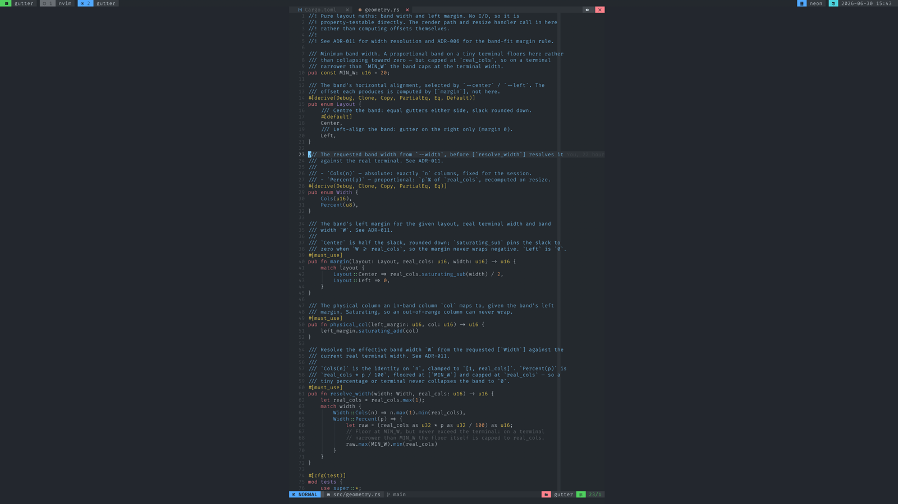

# gutter

Run a terminal program inside a narrower column, while the program still
believes it owns the whole terminal.



`gutter` starts a command in its own pseudo-terminal, renders the output into a
fixed-width band — centred or left-aligned — and passes your keyboard, mouse,
clipboard and window resizes straight through. The program wraps its lines,
positions its cursor and draws full-screen UIs as if the band were the entire
screen, because as far as it knows, it is.

It was built to wrap [Claude Code](https://claude.ai/code) at a comfortable
reading width on a wide monitor, but nothing about it is specific to that. It
works just as well with `vim`, `bash`, `htop`, a REPL, or anything else that
draws to a terminal.

## Why

Monitors are wide; a lot of terminal software reads better in a narrow column —
prose, a code review, a REPL, an AI coding agent that emits long lines. The
usual workarounds are clumsy: shrink the whole window, split a tmux pane and
leave half of it empty, or pipe through something that prefixes each line with
spaces (which falls apart the moment a program tries to move its own cursor).

gutter does the honest thing instead: it hands the program a real terminal that
genuinely is the width you asked for, then paints that terminal wherever you
want it to sit.

## How it works

Think of it as a single-pane tmux whose only job is to reflow your program into
a column you choose:

- The child's pseudo-terminal is sized to the band width `W`, not the real
  terminal width, so the child wraps and lays out at `W` columns naturally.
- gutter runs a terminal emulator (`vt100`) over the child's byte stream,
  keeping a `W`-column virtual screen in sync with what the child is drawing.
- Each frame it repaints that screen on your real terminal, shifted right by a
  margin so the column lands where you asked — centred or hard left.
- Input flows the other way: keystrokes, mouse events (coordinates adjusted for
  the margin), clipboard requests and resizes are translated and forwarded to
  the child.

The embedded emulator is the whole point. Because the child is given a real,
correctly-sized terminal rather than a padded illusion, everything that depends
on knowing the screen geometry — line wrapping, alternate-screen apps, cursor
positioning, scrollback — simply works.

## Install

### Prebuilt binary

Grab the archive for your platform from the
[latest release](https://github.com/stuartc/gutter/releases/latest) — Linux
x86_64 and a universal macOS binary (Apple Silicon + Intel) are published, each
with a SHA-256 checksum. Unpack it and drop `gutter` somewhere on your `$PATH`.

The binaries are unsigned, so on macOS Gatekeeper will refuse to run a freshly
downloaded one. Clear the quarantine attribute first:

```sh
xattr -c ./gutter
```

Or run it once via right-click → Open in Finder and confirm the warning, which
allows it from then on.

### From source

You'll need Rust 1.96.0. It's pinned in `.tool-versions`, so
[asdf](https://asdf-vm.com/) / [mise](https://mise.jdx.dev/) will pick the right
version up automatically. With a toolchain in place:

```sh
cargo install --git https://github.com/stuartc/gutter --locked
```

That drops a `gutter` binary on your `$PATH` (`~/.cargo/bin` by default).
Alternatively, clone the repo and `cargo build --release` to run
`target/release/gutter` directly.

## Usage

```
gutter [--width <N|Npct>] [--center|--left] <cmd> [args...]
```

```sh
gutter --width 80 --center claude     # 80-column band, centred
gutter --width 100 vim notes.md       # absolute width, centred (the default)
gutter --width 50pct --left htop      # half the terminal, hugged to the left
gutter bash                           # no --width: full width, pure passthrough
```

Flags:

- `--width N` — absolute band width in columns, fixed for the session.
- `--width Npct` (or `N%`, or the `--width=N` form) — proportional width,
  recomputed every time you resize the terminal.
- `--center` / `--centre` — centre the band. This is the default.
- `--left` — pin the band to the left edge.

A few things worth knowing:

- Flags are only read _before_ the command. Anything after the command name
  belongs to the child, so `gutter vim --width 100` passes `--width 100` to vim,
  not to gutter.
- There is no `--help`. An unrecognised leading token is taken to be the command
  you want to run.
- With no `--width`, gutter uses the full terminal width and stays out of the
  way — a transparent passthrough.

## What passes through

- **Keyboard**, including the kitty keyboard protocol where your terminal
  supports it (re-encoded to whatever level the child negotiates).
- **Mouse**, with coordinates translated into the band.
- **Clipboard**, via OSC 52.
- **Resizes** — the child is told its new size, and proportional widths
  re-resolve on the spot.

## Working on it

```sh
cargo build
cargo test                       # unit + PTY integration tests
cargo clippy --all-targets
```

The integration tests drive a real PTY and assert on what the outer terminal
actually displays, not on gutter's internals, so they need a valid `TERM` (CI
uses `xterm-256color`).

There's an optional equivalence gate behind the `oracle` feature. It replays
recorded VT byte streams through both gutter's emulator and a second,
independent one (wezterm's) and diffs the resulting cells, so rendering
regressions get caught early. It pulls in a heavier dependency tree, so it's off
by default:

```sh
cargo test --features oracle
cargo clippy --all-targets --features oracle
```

CI runs all five gates: `build`, `test`, `test --features oracle`, and both
clippy passes.

For a deeper tour — the four-thread model, the render loop, the resize and
teardown ordering — see [`CLAUDE.md`](./CLAUDE.md).

## Status

Early days (`0.1.0`). The core works and has been used to wrap Claude Code
daily, but expect rough edges and a moving target.

## Licence

gutter is released under the [GNU General Public License v3.0](./LICENSE).
